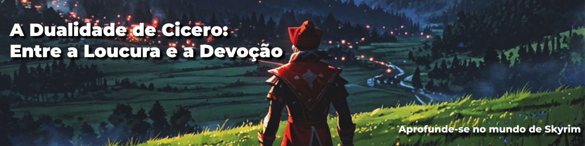

# Atividade: Criando Artigos Técnicos com ChatGPT e Lexica.art
> ℹ️ **NOTE:** Artigo criado durante as aulas do curso Fundamentos de IA da [DIO](https://dio.me).

Este projeto teve como objetivo gerar um artigo utilizando ferramentas de IA. O artigo conta a história de Cicero, um personagem do jogo Skyrim.

  

    
  

  <a href="./article.md" title="View PDF"> CLIQUE AQUI PARA LER</a>

## 💻 Tecnologias utilizadas no projeto

- [ChatGPT](https://chat.openai.com/) 
- [Leonardo.Ai](https://leonardo.ai/)
- [Google Apresentações](https://docs.google.com/presentation)

## 🧠 Prompts

ChatGPT：

<table align="center">
  <thead>
    <th>Ação</th>
    <th>Prompt</th>
  </thead>
  <tbody>
    <tr>
      <td><b>Título</b></td>
      <td>Crie 10 headlines para um texto que apresenta as atitudes boas e ruins de Cicero em Skyrim</td>
    </tr>
    <tr>
      <td><b>Texto</b></td>
      <td>
        Crie um texto com quatro parágrafos: 
        1 - Conte brevemente a história de Cicero e seu papel dentro do jogo Skyrim 
        2 - Cite as atitudes questionáveis do personagem 
        3 - Cite as atitudes coerentes do personagem 
        4 - Conclua se ele foi bom ou ruim 
      </td>
    </tr>
  </tbody>
</table>

Leonardo.Ai：

|  Imagem  | Prompt                                                                                 |
| :----: | -------------------------------------------------------------------------------------- |
| capa | man with red and black clown clothes and clown hat in open field in the skyrim world look to two roads |

Esta IA apresenta modelos de criação, alguns mais realistas, outros mais cartunísticos. O modelo escolhido foi o *Leonardo Anime XL*, que gera imagens no estilo de anime.

## ✨ Features

- Conteúdo gerado via ChatGPT
- Imagens geradas via Leonardo.Ai

## 👨‍💻 Autora

Produzido por Taina Maia, com assistência de IA.